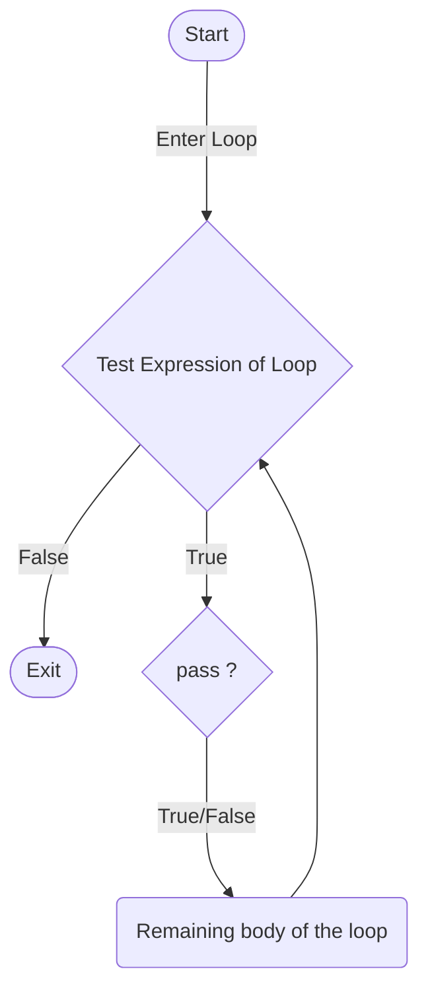

# Introduction to  `pass` Statement
In Python a  **`pass`** statement is used as a placeholder for any piece of code that is yet to be actually added <i>( future code )</i>, due to any reason whether it be that the user doesn’t want any code to execute or the user does not know what code to write.

The  **`pass`**  statement is mostly used when a statement is required syntactically, but no code needs to be executed i.e. a certain code or snippet can not be left empty if nothing is to be executed as it will cause errors in the program.

Similar to the **comment**, the  **`pass`** statement is a null statement however the difference between these is that is that while the interpreter ignores a comment entirely, **`pass`** is not ignored.

# Syntax

The syntax for the  **`pass`** statement is the use of **pass** keyword as a placeholder for the functionality to be added later. 

## Example

In Python, pass statement can be implemented in various different situations depending on the need or requirement of the user.

#### Loops In Python with `pass` statement :

We use  `pass`  statement to write empty loops in python (or even in any other programming languages that support the pass statement.

##### For Loop With  `pass`

```{python}
for i in 'Example':
	pass
print(i)
```
##### Output:
```{HTML}
e
```
<br>
---
<br>

##### While Loop With  `pass`

```{python}
i = 1  
while i < 5:  
    if i == 3:  
        print('pass statement executed')  
        pass  
  print(i)  
    i = i+1  
print(i)
```
##### Output:
```
1
2
pass statement executed
3
4
5
```
<br>

> NOTE: `pass` statements can also be used with other types of control structures such as if, if else, nested if, and also with functions and classes.
```{python}
Other examples of pass statement can be seen as: 

	def Example_function():     # An empty function
		pass

	class Example_class:        # An empty class
		pass
```
<br>

## Flow Chart for a pass statement in a loop in Python


